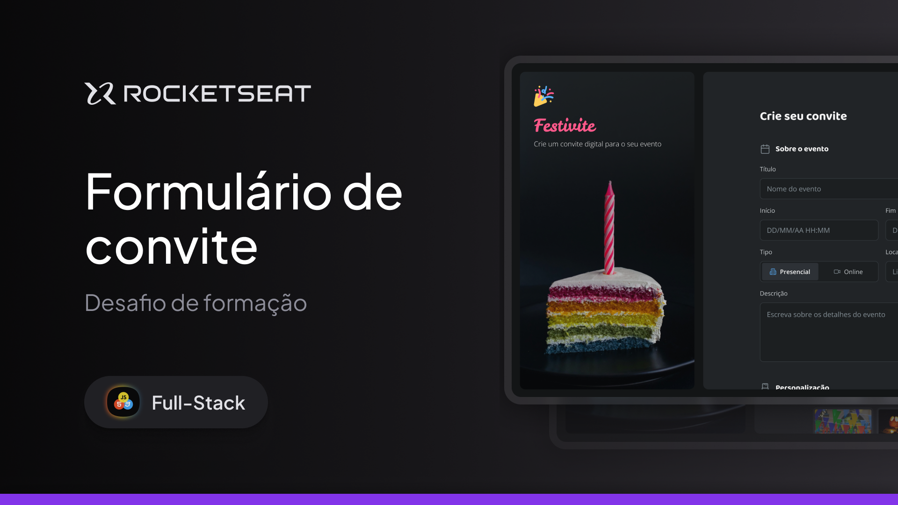

<p align="center">
  
</p>

# 🎫 Convite Digital Personalizável - Rocketseat Full-Stack Challenge

### 🌐 Deploy 

[](https://codebyneander.github.io/form-convite)

## 🚀 Sobre o Projeto

Este projeto é um **convite digital personalizável para eventos**, desenvolvido como parte do desafio prático da **formação Full-Stack da Rocketseat**. A aplicação consiste em um site desktop onde o usuário preenche um formulário com os dados do evento e, em tempo real, um convite estilizado é gerado com base nessas informações.

Esse projeto foi fundamental para transformar a teoria em prática e consolidar os conceitos fundamentais de **HTML5** e **CSS3**, simulando uma entrega real de interface com usabilidade e foco na semântica e acessibilidade.

---

## ✨ Habilidades Técnicas Desenvolvidas

Durante o desenvolvimento, pude aprofundar e consolidar habilidades técnicas essenciais que impactam diretamente minha evolução profissional:

- ✅ **Formulários HTML Semânticos**: criação de campos diversos (`text`, `date`, `radio`, `textarea`), uso apropriado de `label`, `fieldset`, `legend` e hierarquia visual clara.
- ✅ **Estilização Detalhada com CSS**:
  - Aplicação precisa do **Box Model** (padding, margin, border)
  - Uso avançado de **seletores combinados**, pseudo-classes e pseudo-elementos
  - Criação de componentes reutilizáveis com foco em consistência visual
- ✅ **Layout com foco em organização**:
  - Utilização de **Flexbox** e princípios de **Grid Layout** para garantir estrutura responsiva (mesmo com foco desktop)
- ✅ **Leitura e Interpretação de Design no Figma**: capacidade de replicar visualmente o protótipo original respeitando espaçamentos, hierarquia e tipografia.
- ✅ **Resolução de bugs**: enfrentei e resolvi comportamentos inesperados, fortalecendo minha autonomia em debugging e inspeção de elementos.

---

## 📈 Impacto na Minha Formação

Este projeto não é apenas mais uma entrega prática, mas sim um **marco real** no meu desenvolvimento como programador:

- 🔍 **Profundidade no HTML/CSS**: criei estruturas completas e complexas sem frameworks ou JavaScript — o que exige domínio das tecnologias base da Web.
- 🧠 **Pensamento lógico e visual**: transformei entradas em dados renderizados visualmente, o que fortalece minha capacidade de construir experiências dinâmicas.
- 🧰 **Projeto real para o portfólio**: uma aplicação que simula uma funcionalidade concreta e útil, comunicando claramente minhas habilidades para recrutadores.
- ⏱️ **Gestão de tempo e resiliência**: foram quase 10 horas de trabalho intenso, com falhas, retrabalho e superação — o tipo de experiência que não se aprende só com teoria.
- 🧱 **Base para frameworks**: esse projeto prepara o terreno para lidar com estados, componentes e reatividade em frameworks como React.

---

## 🛠️ Tecnologias Utilizadas

- **HTML5** – Estrutura semântica e hierarquia de conteúdo
- **CSS3** – Estilização avançada, Box Model, seletores, pseudo-elementos
- **Flexbox/Grid** – Organização dos blocos de layout
- **Figma** – Interpretação de protótipos e construção visual fiel

---

## 💻 Como Executar Localmente

1. Clone o repositório:
   ```bash
   git clone https://github.com/codebyneander/form-convite.git
    

2. Navegue até a pasta do projeto:
  ```bash
  cd form-convite
  ```

3. Execute o <code>index.html</code> diretamente no navegador (duplo clique) ou utilize o Live Server do VS Code para uma experiência mais fluida.

---

## 📐 Style Guide

O projeto segue rigorosamente o guia de estilo da Rocketseat, respeitando:

* Paleta de cores
* Tipografia
* Espaçamentos e grid
* Hierarquia visual
* Elementos de interação

Referência: protótipo no Figma disponibilizado com o desafio.

---

## 🙏 Agradecimentos

> Agradeço à Rocketseat por mais este desafio prático, que me proporcionou não apenas conhecimento técnico, mas também confiança e clareza sobre meu progresso na formação.
> O conteúdo, os desafios e o ecossistema da plataforma são diferenciais reais na minha jornada.

---

## 📬 Entre em Contato

[](https://www.linkedin.com/in/renan-guilherme/)
[](mailto:renanguilherme.profissional@outlook.com)

---

